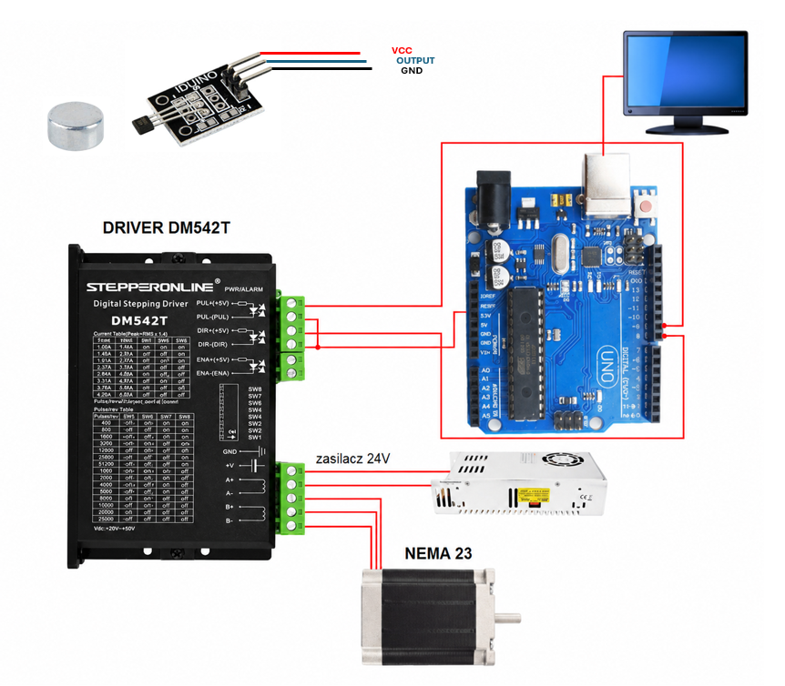

# 5DOF Plant Scanning System

**University Mechatronics Laboratory Team Project**  
**University of Duisburg-Essen**  
**November 2025**

This project was carried out as part of the **Mechatronics Laboratory** course at the **University of Duisburg-Essen**.

---

## Overview

This repository presents the development of a **5-degree-of-freedom (5-DOF) automated plant scanning system** for image acquisition and 3D plant reconstruction.

The project was completed by a **four-member interdisciplinary student team**, combining embedded systems, electronics, mechanical engineering and computer vision.

My primary responsibility was the **embedded systems development and hardware integration**, including Arduino programming, Processing GUI development, electronics integration, motion control and system integration.

---

## My Contributions

I was responsible for the embedded systems and electronics development, including:

- Development of the Arduino software for five-axis motion control
- Development of the Processing-based graphical user interface (GUI)
- Serial communication between the PC and Arduino
- Stepper motor control
- Integration of motor drivers, power supply and sensors
- Hardware wiring and electronics integration
- Design of custom sensor mounts using Siemens NX
- Manufacturing of custom components using 3D printing
- Hardware testing, debugging and system integration

---

## Other Team Responsibilities

### Mechanical System Development

- Redesign and modification of the existing test bench
- Mechanical integration of the 5-DOF motion platform

### Machine Vision & Machine Learning

- Camera selection and integration
- Image acquisition
- Machine vision
- Machine learning
- 3D plant reconstruction

---

## Project Objectives

- Develop a 5-DOF automated motion platform
- Control five stepper motors using an Arduino Mega 2560
- Develop a PC-based graphical user interface (GUI)
- Enable serial communication between the PC and the motion controller
- Integrate sensors and electronic hardware
- Support automated image acquisition for computer vision and 3D plant reconstruction

---

## System Hardware

### Motion System

- 5 Degrees of Freedom (3 Linear + 2 Rotational)
- X-, Y- and Z-axis linear motion
- Pan and Tilt camera mount
- Aluminum profile test bench

### Microcontroller

- Arduino Mega 2560
- USB serial communication

### Motors

- 2 × NEMA 23 stepper motors (X/Y)
- 1 × Dual-shaft NEMA 23 stepper motor with electromagnetic brake (Z)
- 2 × NEMA 17 stepper motors (Pan/Tilt)

### Motor Drivers

- 5 × DM542T stepper motor drivers

### Power Supply

- 24 V DC power supply

### Sensors

- Hall-effect limit switches
- Mechanical limit switches

### Mechanical Components

- Linear guide rails
- Timing belt drive
- Shaft couplings
- Cable drag chains
- Spiral cable protection
- Custom 3D-printed sensor mounts

---

## Technologies

### Programming

- Arduino (C/C++)
- Processing

### Embedded Systems

- Arduino Mega 2560
- Stepper Motor Control
- Serial Communication

### CAD

- Siemens NX
- 3D Printing

### Hardware

- Stepper Motors
- DM542T Stepper Drivers
- Hall-effect & Mechanical Limit Switches
- 24 V DC Power Supply

---

## Processing GUI

The Processing application provides a graphical user interface for controlling the five motion axes of the platform. It allows users to specify movement distances and angles, communicates with the Arduino via USB serial communication and simplifies manual positioning of the camera system.

The screenshot below shows the **final GUI** developed during the project.


> **Note**
>
> The repository contains the latest available source code. The GUI shown in the screenshot represents the final version demonstrated during the project, while the available Processing source code corresponds to an earlier development stage.

---

## Images

### Complete System


### Motion Platform


### Hardware Architecture



### Electronics


### Custom Sensor Mount


---

## Repository Structure

```text
5DOF-Plant-Scanning-System/
│
├── README.md
│
├── arduino/
│   └── PlantScanner.ino
│
├── processing/
│   └── PlantScannerGUI.pde
│
├── docs/
│   └── Project_Report.pdf
│
└── images/
    ├── system_overview.jpg
    ├── motion_platform.jpg
    ├── hardware_architecture.png
    ├── electronics.jpg
    ├── gui.png
    └── sensor_mount.jpg
```

---

## Documentation

The complete project report is available in the **docs** folder.

📄 [Project Report (PDF)](docs/Project_Report.pdf)

---

## Author

**Ali Elbaradie**

M.Sc. Mechanical Engineering (Mechatronics)  
University of Duisburg-Essen
